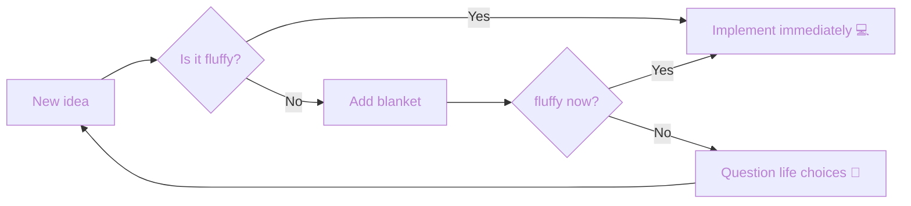

# 🤗🌿 Welcome to the fluffiness! 🌿🤗

Hi, I'm Philine 🌷
Welcome to my little digital garden. Take a moment, look around, and stay as long as you like ☁️

## 🌱 About me

- 💻 Software developer
- 🎨 Artist at heart (painting, light and soft colors)
- 🌿 Lover of calm spaces, nature, and meaningful things
- ☁️ Building projects that feel like home

## 🌸 My cozy tech stack

- 🐧 Manjaro Linux
- ⚛️ TypeScript / React
- 🌿 Java / Spring Boot
- 🐍 Python
- ☕ Coffee-powered debugging

